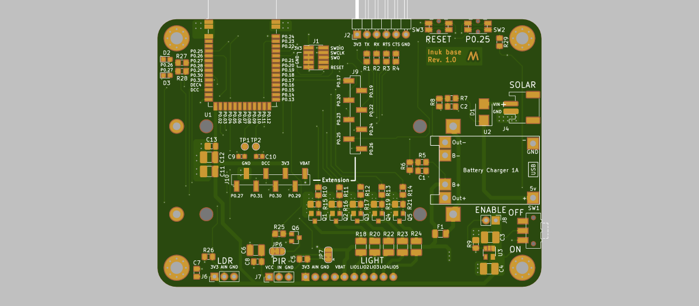

# Inuk base

This board is used in my open source smart garden light project. It is a 2 layer 70 mm x 100 mm design and serves as an NRF52 module carrier.
The board is powered by one 18650 rechargeable lipo and charged by an TP4056 module with a 6V solar cell. The light interface can controll up to five pwm controlled 3W LEDs.

I just released the board to version 1.0 and it will get in production next week (20.04.2020).

###### Click on the image below to see the gerber files

##View in 3D

